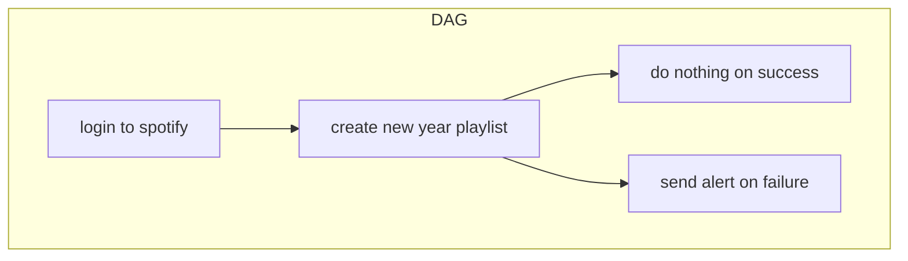
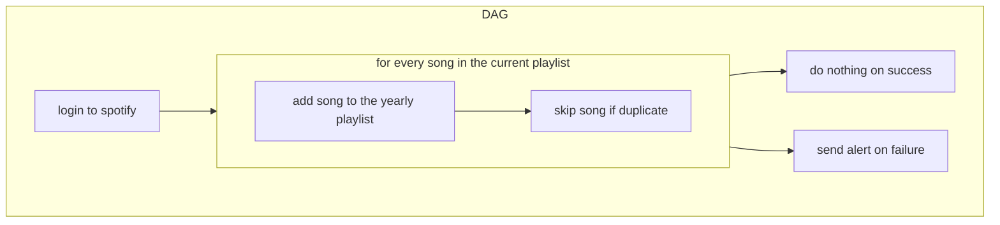
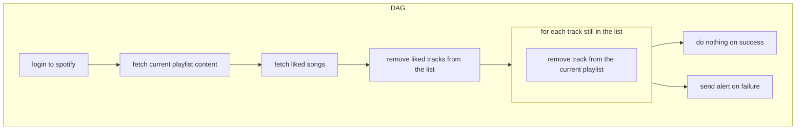

# Spotify Playlist Manager

### Table of content

- [Introduction](#intro)
- [Current setup](#current)
- [Workflows](#workflows)

<a name="intro" />

## Introduction

The aim of this project is to manage my spotify playlist through scheduled workflows.

<a name="current" />

## Current setup

### Yearly playlist

Every new year, a playlist for the following year will be created.

### Current playlist

I add songs to a single playlist, every week it is cleared and every song in it is moved to the yearly playlist, duplicates are skipped.

To easily keep songs that i still wanna listen without having to add them back at the start of the week, every song that I like (unsing liked tracks) is not cleared from the current playlist.

Liked tracks are not synced in the current playlist though.

<a name="workflows" />

## Workflows

There are currently 3 workflows.

### Yearly playlist setup

Running : every new year.

### Yearly playlist update

Running : every week.

### Current playlist update

Running : every week AFTER yearly playlist update.

